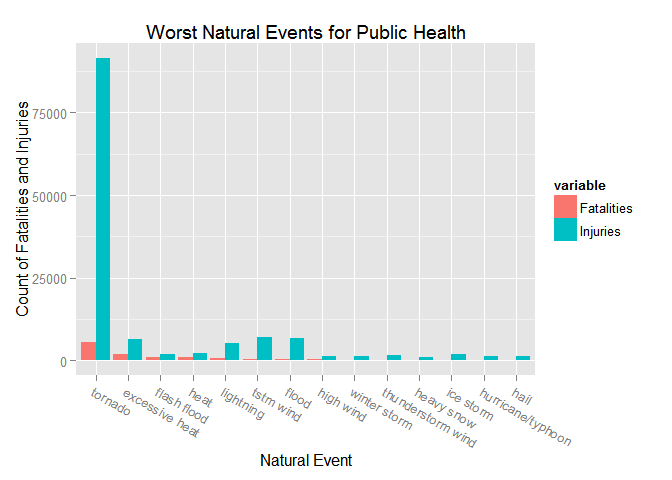
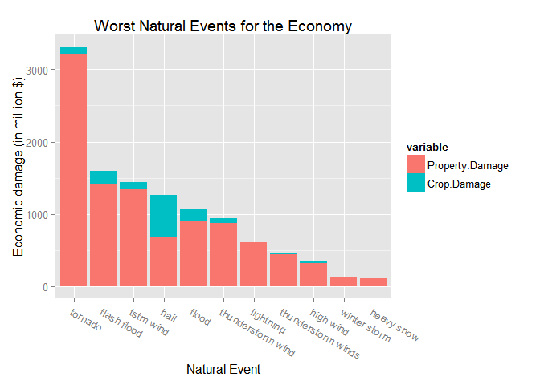

# Reproducible Research: USA Storm Severity Analysis

## Synopsis

Storms and other severe weather events can cause both public health and economic problems for communities and municipalities. Many severe events can result in fatalities, injuries, and property damage, and preventing such outcomes to the extent possible is a key concern. 

This analyis project explores the U.S. National Oceanic and Atmospheric Administration's (NOAA) storm database to establish the health and economic impact of various natural events. See the [MattDSquared github repository](https://github.com/MattDSquared/storm-severity) for details and source code for this project.

Findings indicate that tornadoes, excessive heat, and flash floods cause the most deaths. Tornadoes, flash floods, and thunderstorm winds cause the most economic damage.

_Parts of this synopsis were copied from the Reproducible Research Coursera assignment._

### Questions

This analysis attempts to answer the following questions:

1. Across the United States, which types of events (as indicated in the EVTYPE variable) are most harmful with respect to population health?
2. Across the United States, which types of events have the greatest economic consequences?

## Project Setup

The libraries used in this analysis are:

```r
library(reshape2)
library(data.table)
```

```
## 
## Attaching package: 'data.table'
## 
## The following object is masked _by_ '.GlobalEnv':
## 
##     .N
```

```r
library(plyr); library(dplyr)
```

```
## 
## Attaching package: 'dplyr'
## 
## The following objects are masked from 'package:plyr':
## 
##     arrange, count, desc, failwith, id, mutate, rename, summarise,
##     summarize
## 
## The following objects are masked from 'package:data.table':
## 
##     between, last
## 
## The following object is masked from 'package:stats':
## 
##     filter
## 
## The following objects are masked from 'package:base':
## 
##     intersect, setdiff, setequal, union
```

```r
library(ggplot2)
library(stringr)
```

## Data Processing

The data comes from the U.S. National Oceanic and Atmospheric Administration's (NOAA) storm database. An intermediate download location for this class is hosted on cloudfront:


```r
setwd("~/../datascience/storm-severity")
dir.create("data")
```

```
## Warning in dir.create("data"): 'data' already exists
```

```r
dlURL <- "https://d396qusza40orc.cloudfront.net/repdata%2Fdata%2FStormData.csv.bz2"
filepath <- "data/StormData.csv.bz2"

# set browser to download file through IE protocol (for https)
setInternet2(use = TRUE)
download.file(dlURL, destfile = filepath, mode="wb")
```


```r
stormdata <- read.csv(filepath, stringsAsFactors=FALSE);
```

To answer the two questions posed earlier we only need to care about the columns for `EVTYPE`, `FATALITIES`, `INJURIES`, `PROPDMG`, `PROPDMGEXP`, `CROPDMG`, `CROPDMGEXP`, and `REMARKS`. 

```r
stormdat <- data.table(select(stormdata, EVTYPE, FATALITIES:CROPDMGEXP, REMARKS))
stormdat <- mutate(stormdat, EVTYPE=factor(EVTYPE), 
                   PROPDMGEXP=factor(PROPDMGEXP), 
                   CROPDMGEXP=factor(CROPDMGEXP))
dim(stormdat)
```

```
## [1] 902297      8
```

```r
sapply(stormdat[1,], class)
```

```
##      EVTYPE  FATALITIES    INJURIES     PROPDMG  PROPDMGEXP     CROPDMG 
##    "factor"   "numeric"   "numeric"   "numeric"    "factor"   "numeric" 
##  CROPDMGEXP     REMARKS 
##    "factor" "character"
```

```r
head(stormdat)
```

```
##     EVTYPE FATALITIES INJURIES PROPDMG PROPDMGEXP CROPDMG CROPDMGEXP
## 1: TORNADO          0       15    25.0          K       0           
## 2: TORNADO          0        0     2.5          K       0           
## 3: TORNADO          0        2    25.0          K       0           
## 4: TORNADO          0        2     2.5          K       0           
## 5: TORNADO          0        2     2.5          K       0           
## 6: TORNADO          0        6     2.5          K       0           
##    REMARKS
## 1:        
## 2:        
## 3:        
## 4:        
## 5:        
## 6:
```

### Any missing Values? 


```r
NA.count <- !complete.cases(select(stormdat, FATALITIES:PROPDMG, CROPDMG))
```
There are 0 rows with NA values.

### Managing EVTYPE variable

There are 985 different event types in original `EVTYPE` data, which is much larger than the defined list in the [NOAA instruction sheet](https://d396qusza40orc.cloudfront.net/repdata%2Fpeer2_doc%2Fpd01016005curr.pdf). Let's see if this can be cleaned up. 

### Reducing data set for ease of manipulation

This is a fairly large data set, especially considering the need to do some fairly manual cleaning of the EVTYPE data, as discussed above. First we ignore data which had no adverse impact.  


```r
# filter for adverse effects > 0
stormdat <- filter(stormdat, (FATALITIES+INJURIES+PROPDMG+CROPDMG) > 0)
dim(stormdat)
```

```
## [1] 254633      8
```

```r
length(unique(stormdat$EVTYPE))
```

```
## [1] 488
```

### Basic string cleanup


```r
# clean up variations
stormdat <- mutate(stormdat, 
                   EVTYPE=str_trim(EVTYPE),
                   EVTYPE=tolower(EVTYPE),
                   EVTYPE=gsub("\\.$", "", EVTYPE),
                   EVTYPE=gsub("/ ", "/", EVTYPE))

evtypes <- unique(stormdat$EVTYPE)
length(evtypes)
```

```
## [1] 439
```
That helped a little, but there's still too much data.

Taking a look at values of `EVTYPE`:

```r
head(evtypes, 15)
```

```
##  [1] "tornado"                   "tstm wind"                
##  [3] "hail"                      "ice storm/flash flood"    
##  [5] "winter storm"              "hurricane opal/high winds"
##  [7] "thunderstorm winds"        "hurricane erin"           
##  [9] "hurricane opal"            "heavy rain"               
## [11] "lightning"                 "thunderstorm wind"        
## [13] "dense fog"                 "rip current"              
## [15] "thunderstorm wins"
```
shows several spelling variations for the entry `THUNDERSTORM WINDS`. Also various hurricanes are named and labeled with variations such as `Hurricane Opal`, `Hurricane Erin`, `Hurricane Opal/High Winds`. 

While a better approach would be to merge the NOAA documented event types and evtypes variables via code, time constraints required simply fixing a few spelling variations. Ideally all of the remaining 439 event types in the data would be mapped to the approx 50 defined event types defined from the NOAA documentation. 

```r
# organize event type data to match evtype.def
evtypes <- evtypes[order(evtypes)]
evtypes <- data.table(type.raw=evtypes, type.mapped=evtypes)

# fix common spelling errors for wind, flood, freeze
fixtext <- function(strings, patt, repl) sapply(strings, gsub, 
                                                pattern=patt,
                                                replacement=repl)
pattern.flood <- "\\bflood(ing|in|ed|s)?\\b"
pattern.freeze <- "\\b(freez(e|ing|in|ed|s)?|frozen)\\b"
pattern.wind <- "\\bwi(n|nd|nds|ds|s)?\\b"
pattern.thunderstormwind <- "\\bthund?ers?t(or|ro)ms?\\s?w[a-z0-9]*\\b"
evtypes <- mutate(evtypes, 
                  type.mapped=fixtext(type.mapped, pattern.flood, "flood"),
                  type.mapped=fixtext(type.mapped, pattern.freeze, "freeze"),
                  type.mapped=fixtext(type.mapped, pattern.wind, "wind"),
                  type.mapped=fixtext(type.mapped, pattern.thunderstormwind, 
                                      "thunderstorm wind"))
```

There are still 409 unique event types. Time constraints will require this to be set aside as future work. This will understate any sum-over-EVTYPE value because each variation will have its own category. This will definitely need to be revisited. 

## Results

### Storm effects on health

With this cleaned data set of event types, lets look at how each type can be categorized by effect on health. 

Storm severity can be viewed as combination of fatilities and injuries incurred by an event over the history of this data (since 1950). In this case we'll use total fatalities + injuries as shown the the below plot.


```r
min.injuries <- 1000

summarydata  <- stormdat %>%
    mutate(event=factor(EVTYPE)) %>%
    group_by(event) %>%
    summarize(Fatalities=sum(FATALITIES), Injuries=sum(INJURIES)) %>% 
    filter(Injuries > min.injuries) %>%
    arrange(desc(Fatalities), desc(Injuries)) %>%
    mutate(event=factor(event, as.character(event)))

summarydata_melt <- melt(summarydata, "event")

ggplot(summarydata_melt, aes(event, value, fill=variable)) + 
    geom_bar(stat = "identity", position="dodge") + 
    labs(title="Worst Natural Events for Public Health") +
    labs(x="Natural Event") + 
    labs(y="Count of Fatalities and Injuries") + 
    theme(axis.text.x = element_text(angle = -30, hjust = 0))
```

 

For clarity, only events with more than 1000 injuries were reported.

### Storm effects on economy

Storms also effect the economy in terms of property and crop damage. Event severity for damage can be illustrated by the total monetary damage to property and crops since 1950. 


```r
min.damage <- 100000

summarydata  <- stormdat %>%
    mutate(event=factor(EVTYPE)) %>%
    mutate(TOTALDMG=PROPDMG+CROPDMG) %>%
    group_by(event) %>%
    summarize(Property.Damage=sum(PROPDMG), Crop.Damage=sum(CROPDMG), 
              Total.Damage=sum(TOTALDMG)) %>% 
    filter(Total.Damage > min.damage) %>% 
    arrange(desc(Total.Damage)) %>%
    select(event, Property.Damage, Crop.Damage) %>%
    mutate(event=factor(event, as.character(event)))

summarydata_melt <- melt(summarydata, "event")

ggplot(summarydata_melt, aes(event, value/1000, fill=variable)) + 
    geom_bar(stat = "identity") + 
    labs(title="Worst Natural Events for the Economy") +
    labs(x="Natural Event") + 
    labs(y="Economic damage (in million $)") + 
    theme(axis.text.x = element_text(angle = -30, hjust = 0))
```

 

For clarity, only events with more than $100 million in damages were reported.

## Future Work

Items which would greatly improve this analysis:

* complete mapping of `EVTYPE` to the NOAA-defined events
* Summarizing results as an anual or monthly average
* observing adverse effects over time.
